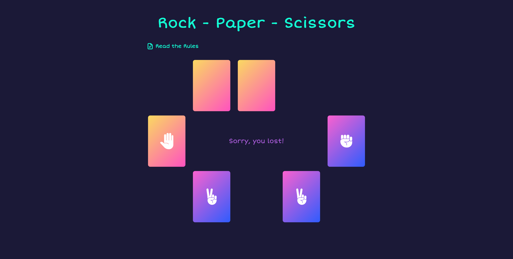

# Rock-Paper-Scissors

## About The Project

 

## Screenshot

### Built With

 

  
  

 
 

<!-- USAGE EXAMPLES -->

## Usage

 

Welcome to the timeless game of Rock Paper Scissors! In this version, you'll be playing against a computer opponent.

Here's how it works:

- To begin, simply click on the "Start New Game" button.
  Both you and your computer opponent will receive three cards each.
- To make your move, click on one of your cards to select it. Your computer opponent will also make its selection simultaneously.
- The game will determine the winner based on the classic Rock Paper Scissors rules.
- Once all three rounds are played, a "Reset" button will appear.
- Clicking on the "Reset" button allows you to start a new round and play again.

Get ready for some thrilling Rock Paper Scissors action against your computer opponent! Press the "Start New Game" button to begin.

(<a href="#readme-top">back to top</a>)

